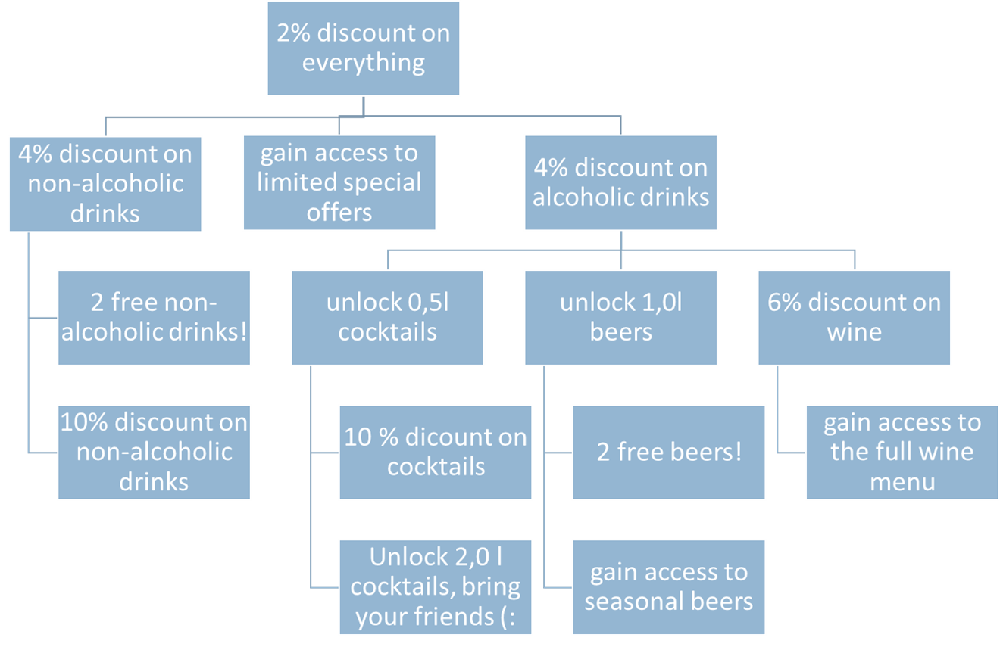

## An RPG for Crowdsourcing a Bar.

When you go into the bar of your choice, you may notice that this is very boring:
You sit there with a couple of friends and drink some drinks.
Maybe someone tells a story you really didn't want to hear, but you are too polite to interrupt.
Really boring.

How cool would it be, if going into the bar would be a RPG-like experience?
YES!
And we built just that at [HackaTUM 2017](https://hack.tum.de/).

## How to get it

If you visit a SPACEbar, you can just go over to the [Google Play Store]() and grab the Android app.
There is an iOS-app as well, but we did not bother with publishing it to the store just yet.
If you are interested, drop us a message, please.

If you want to _run_ a SPACEbar, feel free to get in contact with us, we would be happy to assist you.

## Features

- Simple registration process (no E-Mail etc. required)
- Gain experience points by each order
- Unlock new cool features and skills as you process with your level
- Lend your hand to the bar to gain even more XP
  - Jobbing was never so easy

### The skills

When leveling up in the SPACEbar of your choice, you'll soon want to unlock new cool skills.

The current implementation contains two different types of skills:
- Unlock a discount on some or all items of the menu
- Unlock new menu items

A skill may have follow-up skills, so you may have new skills available for unlock after unlocking another one.

The skill tree of a bar could look similar to this:

For the future, even more skills and skill types are planned:

- Unlock jobbing
- One time free item

## Why SPACEbar is really cool

| For the bar owner | For the visitors |
|-------------------|------------------|
| saves precious money because he does not need as many waitors | have a fun time leveling up |
| Visitors have a motivation to come again | save money by discount-skills they can unlock |

## How to: Compile

### Server

The server is pretty much a standard Spring Boot server with Gradle as a build system.
Run `./gradlew bootRepackage` or `gradlew.bat bootRepackage` to get an executable jar.

### App

Get Visuals Studio (for Mac or Windows) with Xamarin. Open the Project-SPACEbar Project and hit run!

## Technologies used

We built the app with Xamarin to be able to deploy to iOS, Android and Windows at once.
The Server is RESTful and built with Java and Spring Boot.
Because we are a very young and modern team we store our source code in a [blockchain](https://github.com/lacinoire/project-spacebar).

## Next steps for project SPACEbar
- Put the apps in the app store (hopefully this is done for the google play store until tomorrow)
- Launch worldwide
- Extend the SPACEbar with more cool stuff like bar robots, bar lights, IoT, blockchain, cloud, big data, machine learning, SPACEunicorns
